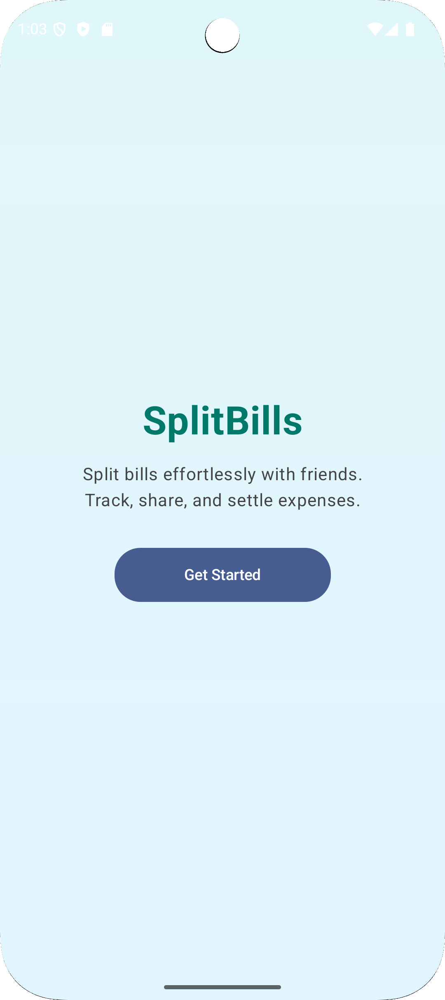
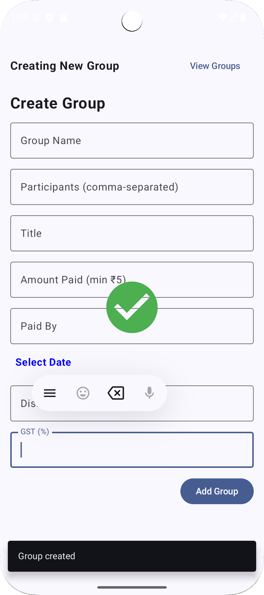
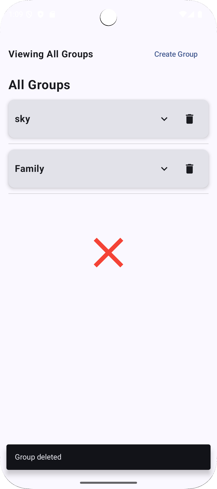
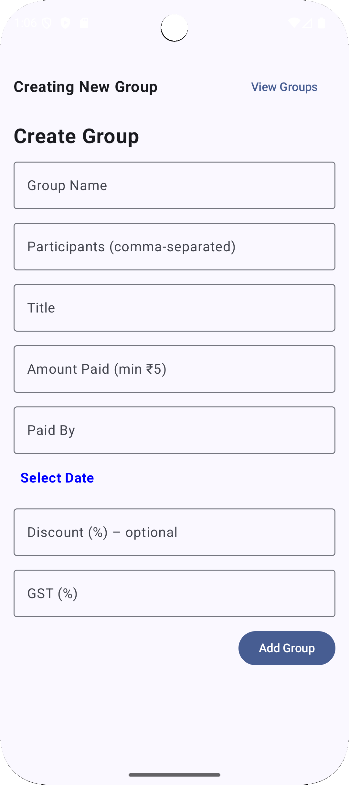
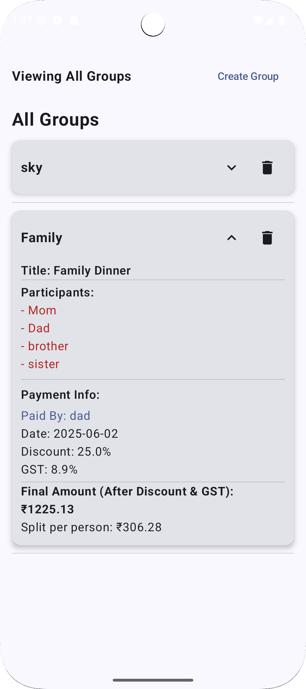

# Smart Expense Splitter App

[](./LICENSE)  
[](https://kotlinlang.org/)  
[](https://developer.android.com/jetpack/compose)  

Smart Expense Splitter is an Android application designed to simplify the way groups manage and split shared expenses. Whether it’s a trip, dinner outing, or household bills, this app lets users create expense groups, record transactions with optional discount and GST, and automatically calculates each member’s share.
  

---

## 🚀 Features

- **Create & Manage Groups**  
  Name your group and add member lists.  

- **Add Transactions**  
  Record amount paid, payer, date, optional discount (0–99.99%), and GST (0.1–99.99%).  

- **Automated Splitting**  
  Calculates final amount after discount & GST, then divides evenly among participants.  

- **Form Validation**  
  Ensures required fields are filled, amount ≥ ₹5, valid discount/GST ranges, and no future dates.  
 
- **Persistent Storage**  
  Uses Room Database (DAO + TypeConverters) for offline data persistence.

- **Visual Feedback**  
  Centered animations on successful creation (✅) and deletion (❌) of groups.  
  
  

  


---

## 🛠️ Tech Stack

- **Language:** Kotlin  
- **UI Framework:** Jetpack Compose  
- **Database:** Room (SQLite) with TypeConverters  
- **Architecture:** MVVM (ViewModel + StateFlow)  
- **Animations:** `AnimatedVisibility`, `scaleIn`, `fadeIn`

---

## ⚙️ Usage

1. **Create Group**  
   - Tap **Create Group**  
   - Fill in: Group Name, Participants, Title, Amount Paid, Paid By, Date  
   - (Optional) Discount and GST  
   - Tap **Add Group** → you see a green check in the center  

   


2. **View Groups**  
   - Tap **View Groups**  
   - Scroll through your groups  
   - Tap the arrow to expand details; tap trash to delete → you see a red cross in the center  
   


---

## 📁 Project Structure

```text
app/
├── src/main/kotlin/com/example/splitterapp
│   ├── data
│   │   ├── dao/          # Room DAO interfaces
│   │   ├── db/           # Room database and converters
│   │   └── model/        # Entity data classes
│   ├── presentation
│   │   └── group/        # Compose screen and ViewModel
│   └── ui/theme/         # Theme definitions
└── build.gradle.kts      # Project Gradle configuration
